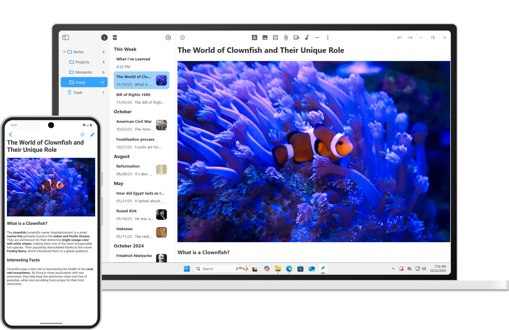

# Amphi Notes

Amphi Notes는 오픈소스이며, 셀프 호스팅 서버로 데이터를 동기화할 수 있는 가벼운 크로스 플랫폼 노트 앱입니다.

## 설치

### 앱

**Android**
- [Play Store](https://play.google.com/store/apps/details?id=com.amphi.notes)

**iOS**
- [App Store](https://apps.apple.com/app/amphi-notes/id6740662483)

**Windows**
- [Scoop](https://github.com/amphi2024/scoop-bucket)

**macOS**
- [Homebrew](https://github.com/amphi2024/homebrew-amphi)

**Linux**
- [AUR](https://aur.archlinux.org/packages/amphi-notes)
- [Flatpak](https://github.com/amphi2024/amphi-flatpak)
- [Snap Store](https://snapcraft.io/amphi-notes)

**Universal**
- [공식 웹사이트](https://amphi.site/notes)
- [GitHub Releases](https://github.com/amphi2024/notes/releases/latest)

### 서버

마인크래프트 서버처럼, `.jar` 파일을 다운로드해서 JVM에서 실행하는 것만으로 간단하게 서버를 구성할 수 있습니다.

시작하기: [웹사이트](https://amphi.site/server) • [GitHub](https://github.com/amphi2024/server)

### 다른앱

서버를 셋업하고 나면, 다른 앱의 데이터도 동기화할 수 있습니다:
- [Amphi Music](https://github.com/amphi2024/music)
- [Amphi Photos](https://github.com/amphi2024/photos)
- [Amphi Cloud](https://github.com/amphi2024/cloud)

## 기여하기

아래와 같은 다양한 방식의 기여를 언제나 환영합니다:

- 번역하기
- 버그고치기
- 미완성된 기능들 구현 (특히 코드에서 TODO로 표시한 부분)

모든 기여가 다 받아들여지지 않을 수 있지만, 여러분의 노력과 관심에는 진심으로 감사드립니다.

기여하기:

- 이메일 보내기: support@amphi.site
- Pull Request 생성하기: [기여 가이드](CONTRIBUTING_KO.md)